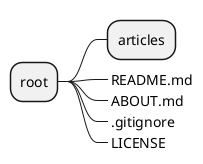
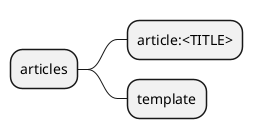

# 项目规划

## 项目目标

- [ ] 支持 Markdown 编写
- [ ] 文章支持标签
- [ ] 文章支持归组
- [ ] 文章支持版本管理
- [ ] 文章支持草稿
- [ ] 文章支持评论
- [ ] 文章支持备份与还原

## 项目设计

项目所有档案、配置均以文件存储，使用 git 作为文章的版本管理

### 目录结构

注意： 带边框的节点表示

#### 整体结构

其中 `articles`为文章目录，`README.md` 、`ABOUT.md` 等文档文件不会被归档, `LICENSE` 或者 `LICENSE.txt` 等文件为所有文档的默认
LICENSE，在文档被处理时会被隐式携带,.gitigore 为内部文件，用于排除不需要的文件，一般不建议编辑。

#### 文档结构

其中，`article:<TITLE>` 表示文档，
