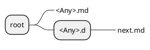
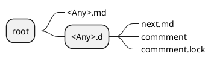
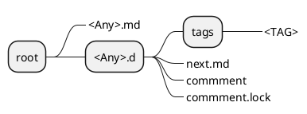
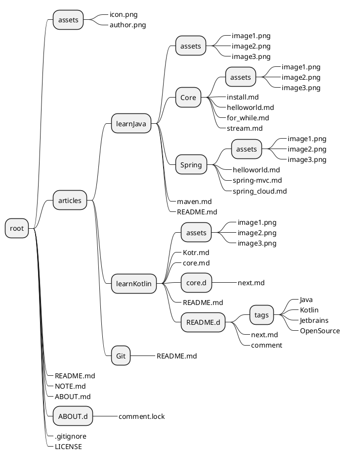

# 项目规划 v1.0-20210826

> 

## 项目目标

- [ ] 支持 Markdown 编写
- [ ] 文章支持标签(文章支持多个标签)
- [ ] 文章支持归组(文章仅支持单个组)
- [ ] 文章支持版本管理
- [ ] 文章支持草稿
- [ ] 文章支持评论
- [ ] 文章支持备份与还原

## 项目设计

项目所有档案均以文件存储，使用 git 作为文章的版本管理。

### 目录结构

注意： 带边框的节点表示目录，不带边框的节点表示文件

#### 根目录结构


`articles`为文章目录，必须存在，`README.md` 、`ABOUT.md` 等文档文件作为单独页面渲染, `assets` 文件夹存放单独页面的资源，`LICENSE`文件为所有文档的默认 `LICENSE` ，在文档被处理时会被隐式携带,`.gitigore` 为内部配置文件，用于排除不需要的文件，一般不建议编辑。其中， `ABOUT.md`、`README.md` 为可选的。

#### 文档树结构

备注：`文档树`表示`文档组`的集合，`文档组`表示属于同一组的一个或多个文档文件集合。


`<TITLE>` 表示一个文档组，`<TITLE>` 为一个自定义变量，一般为文档组标题；`template` 目录为创建文档组的模板组。其中 `template` 是可选的，如果不存在则使用程序预定义规则。

#### 文档组结构


`README.md` 文件为文档组默认文件，必须存在，一般用于注明此文档组的内容梗概，渲染时作为文档首页；`assets` 为文档组默认资源文件夹;`<Any>.md` 文档文件为文档组下其他文档文件，作为扩充文档，变量`<Any>` 为任意名称，此文件为可选的,排序规则取变量`<ANY>`拼音或字母;`<Child Any>` 目录存储的 `<Child Any>.md` 作用与`<Any>.md`相同，仅用于更好的分类，但目录深度建议不超过6层; `LICENSE` 文件为此文档组的`LICENSE`

#### 草稿结构



`<Any>.d` 文件夹为文档文件的扩展目录,用于存放文档的扩展信息。其中，`next.md` 为文档文件的草稿，此文件存在则表明文档有草稿。

注意：一个文档文件仅允许有一个草稿！

#### 评论结构



`<Any>.d` 文件夹为文档文件的扩展目录,用于存放文档的扩展信息。 `comment` 为文档文件 `<Any>.md` 的评论，此文件由内部管理，不建议手动编辑，如果存在文件`commment.lock`则表明此文章不允许被评论。

#### 标签结构



`<Any>.d` 文件夹为文档文件的扩展目录,用于存放文档的扩展信息。`tags` 文件夹存放此文档文件标签，文件`<TAG>`表示此文档文件的标签，其中变量 `<TAG>` 表示标签名称，标签文件应为空白文件。

注意：文档组的子文档会继承`README.md`文档的标签

### 目录结构样例

一个典型的结构如下所示



## 功能实现

### 整体架构

```plantuml
@startuml

@enduml
```
